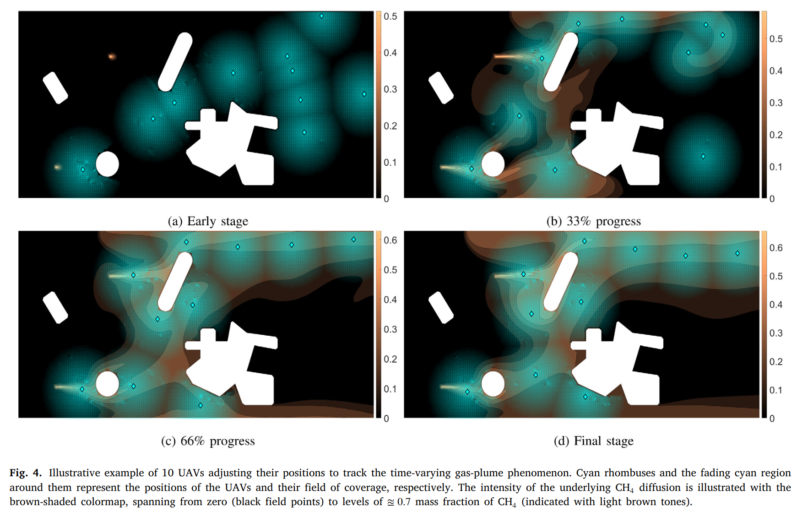

# A distributed, plug-n-play algorithm for multi-robot applications with a priori non-computable objective functions

> _Kapoutsis, A.C., Chatzichristofis, S.A. and Kosmatopoulos, E.B., 2019. A distributed, plug-n-play algorithm for multi-robot applications with a priori non-computable objective functions. The International Journal of Robotics Research, 38(7), pp.813-832._
* [Preprint](https://kapoutsis.info/wp-content/uploads/2019/05/j4.pdf)
* [Journal Article](https://journals.sagepub.com/doi/10.1177/0278364919845054)

This project presents a distributed algorithm applicable to a wide range of practical multi-robot applications. In such multi-robot applications, the user-defined objectives of the mission can be cast as a general optimization problem, without explicit guidelines of the subtasks per different robot.


The main advantage of the proposed algorithm lies in the way of calculating each robot's contribution to the accomplishment of the overall mission objectives. Although each robot does not know explicitly either the decision variables of the other robots nor of their measurements, it is able to update its own decision variables effectively in a way to cooperatively achieve the team objectives. The latter can be achieved through a cost function that is exclusive to each robot, designed so as to encapsulate not only the mission objectives but also the other robots’ dynamics (“data-driven gradient descent” approach: for more details see Section 3 of [here](https://doi.org/10.1177/0278364919845054)). Rigorous arguments establish that despite the fact that the dynamics that govern the multi-robot system are unknown, the proposed methodology shares the same convergence characteristics as those of [block coordinate descent algorithms](https://en.wikipedia.org/wiki/Coordinate_descent). As exhibited in the presented applications, the distributed nature of the proposed algorithm also allows rapid convergence, especially in cases with many robots.

## Applications

### Adaptive coverage control utilizing Voronoi partitioning
The objective for the network of robots is to spread out over an environment, while aggregating in areas of high sensory interest. Furthermore, the robots do not know beforehand where the areas of sensory interest are, but they learn this information online from sensor measurements. The aforementioned task can be found in applications such as environmental monitoring and clean-up, automatic surveillance of rooms/buildings/towns, or search-and-rescue missions.


More information about this setup along with an extensive set of experiment can be found in Section 4 of this [article](https://doi.org/10.1177/0278364919845054):

_Kapoutsis, A.C., Chatzichristofis, S.A. and Kosmatopoulos, E.B., 2019. A distributed, plug-n-play algorithm for multi-robot applications with a priori non-computable objective functions. The International Journal of Robotics Research, 38(7), pp.813-832._

### Three-dimensional surveillance of unknown areas
This applications deals with the problem of deploying a team of flying robots to perform surveillance coverage missions over an unknown terrain of complex and non-convex morphology. In such a mission, the robots attempt to maximize the part of the terrain that is visible while keeping the distance between each point in the terrain and the closest team member as small as possible. A trade-off between these two objectives should be fulfilled given the physical constraints and limitations imposed at the particular application.


More information about this setup along with an extensive set of experiment, including fault-tolerant characteristics and changes in the mission objectives during the execution, can be found in Section 5 of this [article](https://doi.org/10.1177/0278364919845054):

_Kapoutsis, A.C., Chatzichristofis, S.A. and Kosmatopoulos, E.B., 2019. A distributed, plug-n-play algorithm for multi-robot applications with a priori non-computable objective functions. The International Journal of Robotics Research, 38(7), pp.813-832._

### Persistent coverage inside unknown environment
This application assumes that the operational robots are equipped with the appropriate sensors to be cover a limited portion of the environment around their current position. The objective in a persistent coverage application is to continuously cover an area of interest, assuming that the coverage level follows a time-decaying function.


More information about this setup along with an extensive set of experiment can be found in Section 6 of this [article](https://doi.org/10.1177/0278364919845054):

_Kapoutsis, A.C., Chatzichristofis, S.A. and Kosmatopoulos, E.B., 2019. A distributed, plug-n-play algorithm for multi-robot applications with a priori non-computable objective functions. The International Journal of Robotics Research, 38(7), pp.813-832._

### Autonomous and Cooperative Design of the Monitor Positions for a Team of UAVs to Maximize the Quantity and Quality of Detected Objects
This application addresses the problem of positioning a swarm of UAVs inside a completely unknown terrain, having as objective to maximize the overall situational awareness. The situational awareness is expressed by the number and quality of unique objects of interest, inside the UAVs' fields of view. YOLOv3 and a system to identify duplicate objects of interest were employed to assign a single score to each UAVs' configuration.


More information about this setup along with an extensive set of experiment can be found in this [article](https://doi.org/10.1109/LRA.2020.3004780):

_Koutras, D.I., Kapoutsis, A.C. and Kosmatopoulos, E.B., 2020. Autonomous and cooperative design of the monitor positions for a team of UAVs to maximize the quantity and quality of detected objects. IEEE Robotics and Automation Letters, 5(3), pp.4986-4993._

### Building synergetic consensus for dynamic gas-plume tracking applications using UAV platforms
This article investigates the problem of deploying a swarm of UAVs equipped with gas sensors for industrial remote gas-plume sensing. This setup’s objective is to continuously adjust the swarm formation to maximize the combined perception for the dynamically evolved plume’s cloud, focusing around areas with the highest concentration/intensity.



More information about this setup along with an extensive set of experiment can be found in Section 6 of this [article](https://doi.org/10.1016/j.compeleceng.2021.107029):

_Kapoutsis, A.C., Michailidis, I.T., Boutalis, Y. and Kosmatopoulos, E.B., 2021. Building synergetic consensus for dynamic gas-plume tracking applications using UAV platforms. Computers & Electrical Engineering, 91, p.107029._


An extension of such application to incorporate also information from static sensors on the field (WSN) can be found [here](https://doi.org/10.1007/978-3-030-79150-6_48):

_Michailidis, I.T., Kapoutsis, A.C., Kosmatopoulos, E.B. and Boutalis, Y., 2021, June. Dynamic Plume Tracking Utilizing Symbiotic Heterogeneous Remote Sensing Platforms. In IFIP International Conference on Artificial Intelligence Applications and Innovations (pp. 607-618). Springer, Cham._


## Shipped With
Inside the project there are two different multi-robot example frameworks:

[**HoldTheLine**]: A simple problem (toy-problem), where the robots should be deployed in a specific formation (line).

[**AdaptiveCoverage2D**]: In the second simulation setup the objective is to spread out the robots over a 2D environment while aggregating in areas of high sensory interest. An important aspect of the set-up is the fact that, the robots are not aware beforehand of the sensory areas of interest, but they learn this information on-line, utilizing sensor measurements from their current positions.

## Built With

* [IntelliJ IDEA](https://www.jetbrains.com/idea/) - The used java IDEA
* [Maven](https://maven.apache.org/) - Dependency Management

## Add your multi-robot testbed

A valid testbed should contain the following:

-  A class inside the package *testbed.TESTBED_NAME* with name
   ```
   Framework
   ``` 
   that extends the *environment.Setup* class.


-  A properties file inside *resources.testbeds.TESTBED_NAME* with name
   ```
   Parameters.properties
   ```
   that contains all the needed fields (check *Parameters_template.properties* file).

> **Note:** Examples of implemented testbeds along with the corresponing functions can be found inside the *testbeds.AdaptiveCoverage2D* and  *testbeds.HoldTheLine* packages.

## Run the tests

The *validator* class contains tests for each one of the implemented testbeds. In each one of these tests, a series of experiments is executed with different number of robots.

Any new testbed should be acompnied with the appropiate series of unit tests that documents its expected operation/performance.


## Authors

* **Dr. Athanasios Kapoutsis**  - [Personal Site](http://kapoutsis.info/)

## License

This project is licensed under the GNU GPLv3 License - see the [LICENSE.md](LICENSE.md) file for details

## Cite as: 

```
@article{kapoutsis2019distributed,
title={A distributed, plug-n-play algorithm for multi-robot applications with a priori non-computable objective functions},
author={Kapoutsis, Athanasios Ch and Chatzichristofis, Savvas A and Kosmatopoulos, Elias B},
journal={The International Journal of Robotics Research},
year={2019},
volume={38},
number={7},
pages={813-832},
issn={1573-0409},
doi={10.1177/0278364919845054},
publisher={SAGE}
}
```
